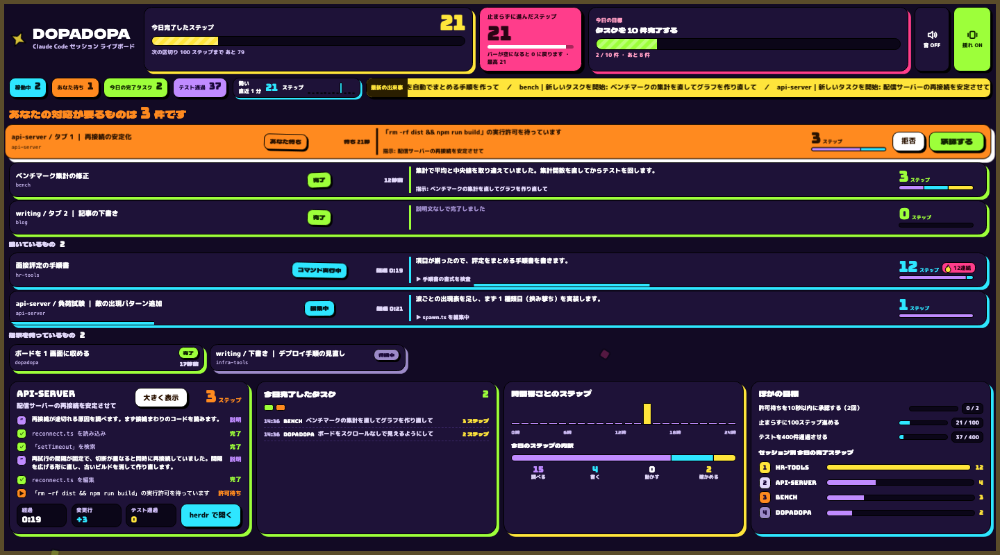

# dopadopa

Claude Code の複数セッションを、ブラウザのライブボードで見渡す [herdr](https://herdr.dev) プラグイン。



## できること

- すべてのセッションを 1 画面に並べ、それぞれの「herdr での場所と題名・状態・いつから・Claude の説明文・いまの操作」を出す
- 冒頭に「あなたの対応が要るものは ◯ 件です」と出し、許可待ちと、完了してまだ見ていないセッションを上に集める
- 今日完了したステップ（ツール操作 1 回の完了）とタスク（1 回の指示への対応完了）を数える。画面に出す数字は実際の作業の数だけ
- 許可待ちのセッションは、ボードから「承認する」「拒否」を押せる
- ステップやタスクの完了を、紙吹雪・画面の揺れ・効果音で知らせる。音と揺れは画面右上で切り替えられ（音は初めはオフ）、OS の「視差効果を減らす」設定では動きが止まる
- 1 つのセッションを大きく表示して、省略なしで読める

## 必要なもの

- herdr 0.9.1 以上（0.9.1 で確認。それより古い版では試していない）
- Node.js 18 以上
- Claude Code と、herdr の Claude Code 連携（`herdr integration install claude`）
- macOS で確認している。Linux でも動く作りだが、試していない

## 入れ方

```sh
herdr plugin install suzuki-junya108/dopadopa
herdr plugin action invoke dopadopa.board.restart   # ブリッジを起動（次回からは herdr の起動時に自動で起動する）
claude plugin marketplace add suzuki-junya108/dopadopa
claude plugin install dopadopa-hooks@dopadopa        # Claude Code にフックを入れる
herdr plugin action invoke dopadopa.board.open      # ブラウザでボードを開く
```

herdr のプラグインは、あなたの権限でこのマシン上のコードを動かす。入れる前に `herdr-plugin.toml` と、そこから呼ばれるスクリプトに目を通すこと。

## フックの入れ方

どちらも同じフック（`claude-code-plugin/hooks/hooks.json`）を入れる。両方入れてもステップは二重に数えない（ブリッジが同じ内容の 2 通目を捨てる）が、片方だけにしておくこと。

| 方法 | 入れる | 外す |
|---|---|---|
| Claude Code のプラグイン（おすすめ） | `claude plugin marketplace add suzuki-junya108/dopadopa` → `claude plugin install dopadopa-hooks@dopadopa` | `claude plugin uninstall dopadopa-hooks@dopadopa` |
| 設定ファイルに足す | `herdr plugin action invoke dopadopa.board.install-hooks` | `node bin/install-hooks.js --remove` |

- プラグインは `~/.claude/settings.json` のフックを書き換えない。Claude Code の `/plugin` 画面から止めたり消したりできる
- 設定ファイルに足す方法は、先にバックアップを取り、既存のフックには触れない。herdr からプラグインを消してもフックは残るので、消す前に外すこと
- 設定ファイルの方法からプラグインへ乗り換えるときは、`node bin/install-hooks.js --remove` で外してからプラグインを入れる
- リポジトリを手元に持っている場合は、`suzuki-junya108/dopadopa` の代わりにそのフォルダのパスを渡せる
- 入れたフックは、次に起動した Claude Code から効く（実行中のものには効かない）
- フックを入れないセッションも、会話記録からステップと説明文を拾って表示する。許可待ちの「承認する」「拒否」ボタンと、タスク完了の正確な瞬間はフックが要る

## セキュリティ

127.0.0.1 のみで待ち受け、起動ごとのランダムトークン（`~/.dopadopa/token`, 0600）がない要求は、ボードのページを含めてすべて拒否する。ボードは「ボードを開く」操作がトークン付きの URL で開く（URL はブラウザの履歴に残る。トークンはブリッジを再起動すると変わる）。

## 扱うデータ

- フックは、Claude Code への指示文・実行するコマンド・ツールの入力と出力を、このマシン内のブリッジに送る。ブリッジはそれを使って画面を作り、指示文の冒頭 120 文字・コマンドの説明（無ければコマンドの 1 行目、130 文字まで）・ファイル名をボードに表示する
- ブリッジは、herdr から各セッションの題名（端末のタイトル）と、ワークスペース・タブの名前を読み、ボードに表示する
- ブリッジは、herdr に出ている各セッションの会話記録（`~/.claude/projects/*/<セッションID>.jsonl`）の追記分をこのマシン内で読み、Claude が書いた説明文（280 文字まで）をボードに表示する。フックを入れていないセッションでは、指示文と操作もここから読む。読むのは herdr かフックが知らせたセッション ID のファイルだけ
- ファイルに保存するのは、今日の件数（ステップ・ステップの内訳・タスク・テスト・時間帯ごとのステップなど）と、完了したタスクの時刻・フォルダ名だけ（`stats-YYYY-MM-DD.json`）。指示文・説明文・コマンド・ツールの出力は保存しない
- マシンの外への通信は、ボードがフォントを読み込む Google Fonts だけ。作業内容は外に送らない
- ボードの「herdr で開く」は、herdr の中でそのセッションに切り替えたうえで、herdr を表示している端末アプリを前に出す（macOS のみ。`ps` で端末アプリを探して `open -a` で前に出すだけで、キーは送らない）
- ボードの「承認する」「拒否」は、その許可待ちのペインに `Enter` / `esc` を 1 回だけ送る。画面のボタンを押したとき以外は送らない

## 設定

- ポートを変える: `herdr plugin config-dir dopadopa.board` が示すフォルダに `env` というファイルを作り、`DOPADOPA_PORT=4600` のように書いて、ブリッジを再起動する（初期値は 4517）
- herdr の操作: 「ボードを開く」「ブリッジを再起動」「ブリッジを停止」「Claude Code のフックを入れる」

## 外し方

```sh
herdr plugin action invoke dopadopa.board.stop
claude plugin uninstall dopadopa-hooks@dopadopa      # 設定ファイルに足した場合は node bin/install-hooks.js --remove
herdr plugin uninstall dopadopa.board
```

`~/.dopadopa/`（トークン・ポート番号・転送スクリプト）と、herdr が用意したプラグイン用のフォルダ（今日の件数とブリッジのログ）は残る。不要なら手で消す。

## 開発

- 最初に読むもの: `CLAUDE.md` → `HANDOFF.md`（引き継ぎ用のプロンプトは `HANDOFF_PROMPT.md`）
- 手元のフォルダを登録する: `herdr plugin link "$PWD"` → `herdr plugin action invoke dopadopa.board.restart`
- テスト: `npm test`、構文チェック: `npm run check`

## ライセンス

[MIT](LICENSE)
